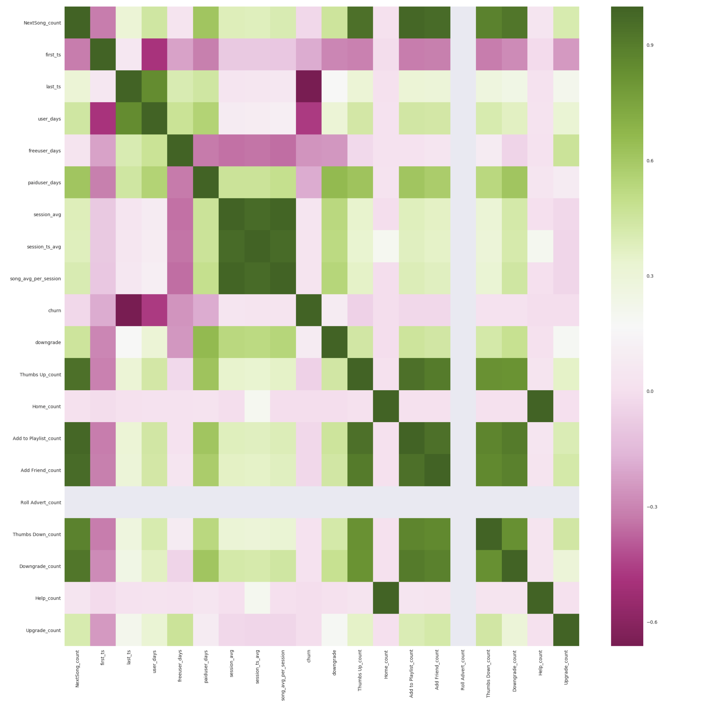
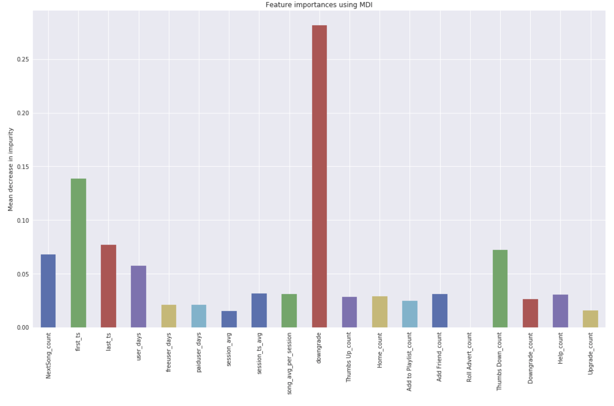

# Using Apache Spark and big data analysis to predict churn in online services

## Project Overview

This project is a big data analysis for popular digital music services similar to Spotify or Pandora.

This project is my capstone project of the Udacity data scientist nanodegree.

Users generate the data with every action like song play, likes, upgrade, downgrade, etc. analyze data to which users are at risk to churn or downgrade. 

We're provided a large dataset of 12GB, use Amazon AWS services to analyze this data.

This is the link of Blog post about this code. https://medium.com/@togawamanabu/using-apache-spark-and-big-data-to-predict-churn-in-online-services-9c3513094b0c


## Problem Statement

This Sparkify web service has a certain churn rate. In order to reduce the churn rate as much as possible, we would like to analyze the user’s log data and predict the users who are likely to churn and prevent them from churning.

## Metrics 

Set a churn flag for churned users and predict this with 0 and 1.
1 is a churned user.
Separate all the data into training and test data, create a model using the training data, and then use the test data to determine the F1 score and accuracy to select the most accurate model and parameter.

### Dataset

The dataset contains users' activity log. we can track user's activity with **userid** and **session**, user's action is recorded in **page** column.
```
 |-- artist: string (nullable = true)
 |-- auth: string (nullable = true)
 |-- firstName: string (nullable = true)
 |-- gender: string (nullable = true)
 |-- itemInSession: long (nullable = true)
 |-- lastName: string (nullable = true)
 |-- length: double (nullable = true)
 |-- level: string (nullable = true)
 |-- location: string (nullable = true)
 |-- method: string (nullable = true)
 |-- page: string (nullable = true)
 |-- registration: long (nullable = true)
 |-- sessionId: long (nullable = true)
 |-- song: string (nullable = true)
 |-- status: long (nullable = true)
 |-- ts: long (nullable = true)
 |-- userAgent: string (nullable = true)
 |-- userId: string (nullable = true)
```

Dataset is provided from the Udacity Datascience ND cource.

**s3n://udacity-dsnd/sparkify/sparkify_event_data.json**

Smaller subset is inside the repository **dataset/mini_sparkify_event_data.json**

### Files

 - README.me : This readme file
 - Sparkify.ipynb : Main Jupter note book and program.
 - dataset/ : small subset of json data 
   - mini_sparkify_event_data.json.zip : zipped small data
 - notebook/ : jupyter notebook directory
   - Sparkify_for_small_dataset.ipynb : Jupyter notebook for small dataset 
   - Sparkify_for_small_dataset.html : HTML version of jupyter 
   - Sparkify_full_dataset_on_emr.ipynb : Jupyter notebook for Full dataset on the Amazon EMR. 
  

### Program and Libraries

- Spark 2.4.3 : https://spark.apache.org/
- Python 3.8.8 : https://www.python.org/
- Jupyter Notebook : https://jupyter.org/
- Pandas : https://pandas.pydata.org/
- NumPy : https://numpy.org/
- Matplotlib : https://matplotlib.org/
- Seaborn : https://seaborn.pydata.org/
- Scikit-lean : https://scikit-learn.org/stable/


## Problem Statement

This size of data is not possible to analyze on a local machine, Therefore, we use clustering data analysis tools such as Spark to analyze the data.

Also, the data contains unnecessary data, NaN values, duplicates, etc. Cannot be analyzed as is. so, we will clean the data, prepare the data for analysis, and create a model.

Since we don't know which model and parameters are the most optimal, we try multiple models and parameters and select the most accurate model.

## Metrics 

Set a churn flag for churned users and predict this with 0 and 1. 
1 is a churned user.
Separate all the data into training and test data, create a model using the training data, and then use the test data to determine the F1 score and accuracy to select the most accurate model and parameter.


## ETL(extract, transform, load) pipeline

In this preprocess, checked NaN values, define Churn, create these features by userId dataframe,
and joined a them to use for ML model.

- gender
- level
- device
- total song played
- first_ts
- last_ts
- days from start
- free days
- payed days
- total add friend
- total add to playlist
- total downgrade
- total error
- total help
- total home
- total roll advert
- total upgrade
- total thumb down
- total thumb up
- total session
- average time between per session
- average song played per session
- location
- device

This is correlation heat map between features.



## Modeling

We used these models.

- Logistic Regression Model
- Random Forest Model
- Gradient-Boosted Trees (GBTs)

## Conclusion

We created F1 score 0.79 and 80.4% accuracy Random forest model,
We can find downgrade is highly correlate to the churn, and from first_ts feature new users are also higher churn, more thumbs downing users are also higher churn. 
We set up a cluster of Spark and AWS and found that we could analyze as much as 12GB of data at high speed.
Spark provides a variety of models, just like scikitlearn, and it's able to connect pipelines to analyze a variety of data in a flexible way.



# References

Udacity Data scientist Nano degree : https://www.udacity.com/course/data-scientist-nanodegree--nd025
Apache Spark Document : https://spark.apache.org/docs/latest/api/python/index.htmlhttps://spark.apache.org/docs/latest/api/python/index.html
Wikipedia : https://en.wikipedia.org/wiki/Gradient_boosting
Wikipedia : https://en.wikipedia.org/wiki/Random_forest